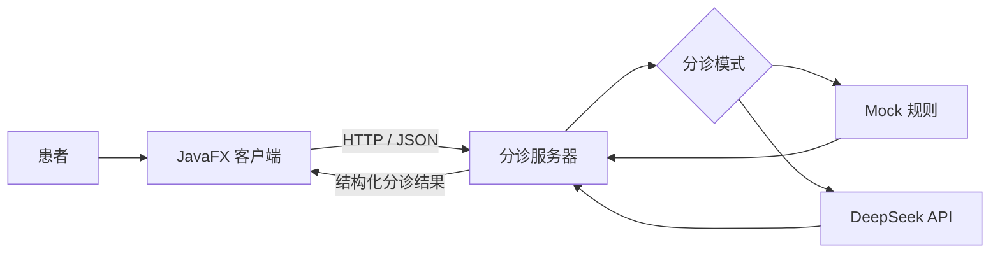

# 医疗预分诊系统

面向医院门诊大厅、自助服务机和咨询台场景的医疗预分诊课程项目。患者在 JavaFX 客户端输入或语音录入症状，客户端通过 HTTP/JSON 请求分诊服务器，服务器返回推荐科室、紧急程度、是否建议急诊和就诊提示。

> 本项目仅用于课程学习、原型展示和门诊预分诊流程演示。它不是医疗器械，不提供疾病诊断或用药建议，不能替代医生判断。症状严重或快速加重时，应立即联系现场医护人员或前往急诊。

## 功能概览

- JavaFX 中文客户端界面
- 本地离线中文语音识别输入，基于 sherpa-onnx
- 症状输入校验、1000 字符限制和异步请求
- HTTP/JSON 客户端与服务器通信
- 推荐科室、紧急程度、急诊提示和回复展示
- 服务器健康检查接口
- Mock 规则模式和 DeepSeek 模式
- macOS arm64 与 Windows x64 客户端 release
- release 通过 `server-url.txt` 修改服务器地址，无需重新打包

## 项目结构

```text
Medicial-Predistribution-System/
├── README.md
├── PredistibutionSystem_OverallPlanning.md
├── pom.xml
├── release/
│   ├── README.md
│   ├── RELEASE_NOTES.md
│   └── macos/
│       ├── server-url.txt
│       └── start-with-server-url.command
├── triage-client/
│   ├── libs/
│   ├── models/                    # 仓库内仅保留说明，完整模型在 release 包中
│   ├── src/
│   └── pom.xml
└── triage-server/
    ├── src/
    └── pom.xml
```

## Release 使用

最终客户端 release 请在 GitHub Releases 的 `v1.0.0` 附件中下载。本地打包产物位于 `release/`，但大型 zip 和 `.app` 不提交到普通源码分支。

- macOS Apple Silicon: `release/macos/MedicalTriageClient-1.0.0-macos-arm64.zip`
- Windows x64: `release/windows/MedicalTriageClient-1.0.0-windows-x64.zip`

使用 release 前，需要先启动 `triage-server`。客户端通过同目录的 `server-url.txt` 指定服务器地址，例如：

```text
http://192.168.1.100:8080
```

macOS 用户解压后双击：

```text
start-with-server-url.command
```

Windows 用户解压后双击：

```text
start-with-server-url.bat
```

不要直接双击 `.app` 或 `.exe`，否则不会读取 `server-url.txt` 中的地址。更完整的 release 说明见 [release/README.md](release/README.md)。

## 技术栈

| 模块 | 技术 |
| --- | --- |
| 客户端 | Java 21、JavaFX 21、FXML、CSS |
| 语音识别 | sherpa-onnx、本地离线中文模型 |
| 服务端 | Java 17+、JDK HttpServer、Jackson |
| AI | Mock 规则、DeepSeek API |
| 日志 | SLF4J、Logback |
| 构建 | Maven 多模块项目 |
| 测试 | JUnit 5、HTTP 集成测试 |

## 系统架构



## 环境要求

源码运行需要：

- JDK 21 或更高版本
- Maven 3.9 或更高版本
- IntelliJ IDEA 推荐

服务器源码兼容 Java 17+。客户端使用 JavaFX 21，推荐 JDK 21+。

## 源码运行

### 1. 构建和测试

```bash
mvn clean test
```

### 2. 启动服务器

在 IntelliJ IDEA 中运行：

```text
triage-server/src/main/java/com/triage/MainApplication.java
```

或命令行运行：

```bash
mvn -pl triage-server package
java -jar triage-server/target/triage-server-1.0.0.jar
```

服务器默认监听：

```text
http://localhost:8080
```

健康检查：

```bash
curl http://localhost:8080/api/health
```

### 3. 启动客户端源码

先确认 `triage-client/src/main/resources/application.properties` 中的服务器地址：

```properties
server.base-url=http://localhost:8080
server.connect-timeout-seconds=5
server.request-timeout-seconds=30
speech.model-dir=models/sherpa-onnx-streaming-zipformer-zh-xlarge-int8-2025-06-30
```

局域网联调时，将 `localhost` 改为服务器电脑的 IPv4 地址：

```properties
server.base-url=http://192.168.1.100:8080
```

也可以通过环境变量临时覆盖：

```bash
export TRIAGE_SERVER_BASE_URL=http://192.168.1.100:8080
```

启动客户端：

```bash
mvn -pl triage-client javafx:run
```

## 局域网联调

服务器和客户端在不同电脑时：

1. 两台电脑连接同一个局域网。
2. 在服务器电脑启动 `triage-server`。
3. 服务器电脑允许 Java 或 TCP 端口 `8080` 通过防火墙。
4. 客户端的 `server-url.txt` 或 `application.properties` 填写服务器电脑 IPv4 地址。
5. 客户端电脑检查健康接口。

macOS / Linux:

```bash
curl http://192.168.1.100:8080/api/health
```

Windows PowerShell:

```powershell
Test-NetConnection 192.168.1.100 -Port 8080
Invoke-RestMethod http://192.168.1.100:8080/api/health
```

如果健康接口返回 `{"status":"UP"}`，说明网络和服务器基本可用。

## API

### 健康检查

```http
GET /api/health
```

响应示例：

```json
{
  "status": "UP",
  "aiMode": "mock"
}
```

### 提交分诊信息

```http
POST /api/triage/message
Content-Type: application/json
```

请求示例：

```json
{
  "message": "我最近一直咳嗽、发烧"
}
```

响应示例：

```json
{
  "success": true,
  "recommendedDepartment": "发热门诊",
  "urgencyLevel": "high",
  "needEmergency": true,
  "reply": "建议立即前往发热门诊就诊，并做好个人防护，避免与他人密切接触。"
}
```

## DeepSeek 配置

服务器支持 Mock 和 DeepSeek 两种模式。当前配置文件中使用 DeepSeek 模式；如果没有 API Key，或只需要离线演示，可以改为 Mock 模式：

```properties
triage.ai.mock=true
```

如需使用 DeepSeek：

1. 修改 `triage-server/src/main/resources/application.properties`：

```properties
triage.ai.mock=false
```

2. 设置环境变量：

```bash
export DEEPSEEK_API_KEY=your-api-key
```

3. 重新启动服务器。

不要将 API Key 写入源码、配置文件或提交到 GitHub。

## 语音识别说明

客户端使用 sherpa-onnx 本地离线中文模型。语音不会上传到服务器，识别文字只会填入症状输入框，不会自动提交。

源码运行语音识别时需要本地模型。由于模型文件过大，源码仓库只保留 `triage-client/models/README.md` 说明；完整模型已包含在客户端 release 包中。

模型目录：

```text
triage-client/models/sherpa-onnx-streaming-zipformer-zh-xlarge-int8-2025-06-30
```

macOS 第一次使用语音输入时，需要允许应用访问麦克风。

## 测试

运行全部测试：

```bash
mvn clean test
```

测试覆盖内容包括：

- 客户端 JSON 响应解析
- 输入校验
- Mock 分诊规则
- 高危症状识别
- HTTP 健康检查
- HTTP 分诊接口集成测试

## 安全说明

- 本项目不是医疗器械或诊断系统。
- 不应根据本系统结果自行用药或延误就医。
- 高危情况必须由现场医护人员进一步判断和处理。
- 当前服务器没有用户认证和 HTTPS，不应直接暴露到公网。
- 不要在日志或仓库中保存患者姓名、身份证号、手机号等敏感信息。
- 真实部署前需要经过医院、医学专家和信息安全人员评估。

## 课程文档

详细开发规划见 [PredistibutionSystem_OverallPlanning.md](PredistibutionSystem_OverallPlanning.md)。
