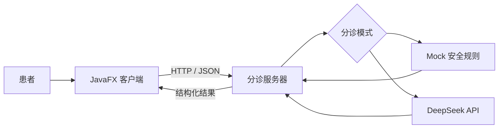

# 医疗预分诊系统

一个面向医院门诊大厅、自助服务机和咨询台场景的医疗预分诊课程项目。

患者可以在 JavaFX 客户端描述症状，客户端通过 HTTP/JSON 将内容发送到服务器。服务器根据本地安全规则或大模型结果，返回推荐科室、紧急程度和就诊提示。

> 本系统仅用于课程学习和门诊预分诊演示，不进行疾病诊断，不提供具体用药建议，也不能替代医生判断。

## 项目状态

目前已完成第一阶段 MVP：

- JavaFX 客户端症状输入与结果展示
- 客户端和服务器 HTTP/JSON 通信
- 推荐科室、紧急程度和急诊提示
- 高危症状优先识别
- 无法识别时提示用户补充信息
- 输入校验、连接失败和请求超时提示
- Mock 规则模式与 DeepSeek 模式切换
- 单元测试和 HTTP 集成测试

## 系统架构



## 技术栈

| 模块 | 技术 |
| --- | --- |
| 客户端 | Java 21、JavaFX 21、FXML、CSS |
| 服务器 | Java 17、JDK HttpServer、Jackson |
| AI | Mock 规则、DeepSeek API（可选） |
| 日志 | SLF4J、Logback |
| 构建 | Maven 多模块项目 |
| 测试 | JUnit 5、HTTP 集成测试 |

## 项目结构

```text
PredistibutionSystem/
├── triage-client/                 # JavaFX 客户端
│   ├── src/main/java/
│   ├── src/main/resources/
│   ├── src/test/java/
│   └── pom.xml
├── triage-server/                 # HTTP 分诊服务器
│   ├── src/main/java/
│   ├── src/main/resources/
│   ├── src/test/java/
│   └── pom.xml
├── PredistibutionSystem_OverallPlanning.md
├── pom.xml                        # Maven 聚合配置
└── README.md
```

## 第一阶段功能

### 客户端

- 自适应 JavaFX 中文界面
- 症状输入和 1000 字符长度限制
- 异步发送请求，避免界面卡顿
- 展示推荐科室、紧急程度和急诊提示
- 处理空输入、网络断开、超时和服务器异常
- 可通过配置文件修改服务器地址

### 服务器

- `POST /api/triage/message` 分诊接口
- `GET /api/health` 健康检查接口
- 请求内容和长度校验
- Mock 与 DeepSeek 两种分诊模式
- 统一 JSON 响应和基础异常处理
- 日志记录和自动化测试

### Mock 安全规则

默认模式不需要联网或 API Key，可用于第一阶段演示。

- 严重失血、呼吸困难、意识不清等高危表现优先转急诊科
- 普通咳嗽、发热等症状推荐呼吸内科
- 腹痛、腹泻等症状推荐消化内科
- 皮疹、瘙痒等症状推荐皮肤科
- 无法识别具体症状时不随意推荐科室，而是提示补充信息
- 院内高危提示要求呼叫现场医护人员并启动院内急救流程

这些规则只用于课程演示，不构成真实医疗建议。

## 环境要求

- JDK 21 或更高版本
- Maven 3.9 或更高版本
- IntelliJ IDEA（推荐）

服务器源码兼容 Java 17，客户端使用 Java 21。

## 快速开始

### 1. 克隆项目

```bash
git clone <your-repository-url>
cd PredistibutionSystem
```

### 2. 构建和测试

```bash
mvn clean test
```

### 3. 启动服务器

在 IntelliJ IDEA 中运行：

```text
triage-server/src/main/java/com/triage/MainApplication.java
```

服务器默认监听：

```text
http://localhost:8080
```

启动成功后，控制台会显示：

```text
HTTP 服务端启动成功
分诊接口: POST http://localhost:8080/api/triage/message
```

也可以通过命令行打包并启动：

```bash
mvn -pl triage-server package
java -jar triage-server/target/triage-server-1.0.0.jar
```

### 4. 配置客户端

编辑：

```text
triage-client/src/main/resources/application.properties
```

服务器和客户端在同一台电脑时：

```properties
server.base-url=http://localhost:8080
server.connect-timeout-seconds=5
server.request-timeout-seconds=30
```

局域网联调时，将 `localhost` 替换为服务器电脑的 WLAN IPv4 地址：

```properties
server.base-url=http://192.168.1.100:8080
```

也可以通过环境变量临时覆盖：

```text
TRIAGE_SERVER_BASE_URL=http://192.168.1.100:8080
```

### 5. 启动客户端

推荐在 IntelliJ IDEA 的 Maven 面板中运行：

```text
医疗预分诊系统客户端
  -> 插件
  -> javafx
  -> javafx:run
```

命令行启动：

```bash
mvn -pl triage-client javafx:run
```

## 局域网联调

服务器和客户端位于不同电脑时：

1. 两台电脑连接同一个局域网。
2. 服务器电脑运行 `MainApplication`。
3. 服务器电脑允许 Java 或 TCP 端口 `8080` 通过防火墙。
4. 客户端将 `server.base-url` 设置为服务器电脑的 IPv4 地址。
5. 客户端电脑检查端口：

```powershell
Test-NetConnection 192.168.1.100 -Port 8080
```

看到以下内容表示端口可达：

```text
TcpTestSucceeded : True
```

然后检查健康接口：

```powershell
Invoke-RestMethod http://192.168.1.100:8080/api/health
```

## API

### 健康检查

```http
GET /api/health
```

响应示例：

```json
{
  "status": "UP",
  "aiMode": "mock"
}
```

### 提交分诊信息

```http
POST /api/triage/message
Content-Type: application/json
```

请求示例：

```json
{
  "message": "我最近一直咳嗽"
}
```

响应示例：

```json
{
  "success": true,
  "recommendedDepartment": "呼吸内科",
  "urgencyLevel": "medium",
  "needEmergency": false,
  "reply": "建议优先咨询呼吸内科。请补充症状持续时间、最高体温，以及是否伴有呼吸困难或胸痛。"
}
```

高危结果示例：

```json
{
  "success": true,
  "recommendedDepartment": "急诊科",
  "urgencyLevel": "high",
  "needEmergency": true,
  "reply": "请勿自行走动，立即呼叫现场医护人员，由工作人员启动院内急救流程并转送急诊科。"
}
```

## 使用 DeepSeek

默认配置使用 Mock 模式：

```properties
triage.ai.mock=true
```

切换到 DeepSeek：

1. 修改 `triage-server/src/main/resources/application.properties`：

```properties
triage.ai.mock=false
```

2. 设置环境变量：

```text
DEEPSEEK_API_KEY=your-api-key
```

3. 重新启动服务器。

不要将 API Key 写入源码、配置文件或提交到 GitHub。

## 测试

运行全部测试：

```bash
mvn clean test
```

测试内容包括：

- 客户端响应 JSON 解析
- 普通咳嗽分诊
- 严重失血高危识别
- 胸痛伴冷汗高危识别
- 消化系统症状分诊
- 无关输入的补充信息提示
- 服务器健康检查
- 真实 HTTP 请求和结构化响应

## 后续计划

- 更严格的结构化分诊结果校验
- 多轮追问与会话管理
- 医院科室信息配置
- 更完整的高危症状规则
- 数据库和匿名日志
- 管理后台
- JavaFX 客户端安装包
- 语音输入、打印和院内地图导航

## 安全说明

- 本项目不是医疗器械或诊断系统。
- 不应根据本系统结果自行用药或延误就医。
- 高危情况必须由现场医护人员进一步判断和处理。
- 真实部署前需要经过医院、医学专家和信息安全人员评估。
- 不应在日志或仓库中保存患者姓名、身份证号、手机号等敏感信息。
- 当前服务器没有用户认证和 HTTPS，不应直接暴露到公网。

## 课程文档

详细开发规划参见：

[PredistibutionSystem_OverallPlanning.md](PredistibutionSystem_OverallPlanning.md)
